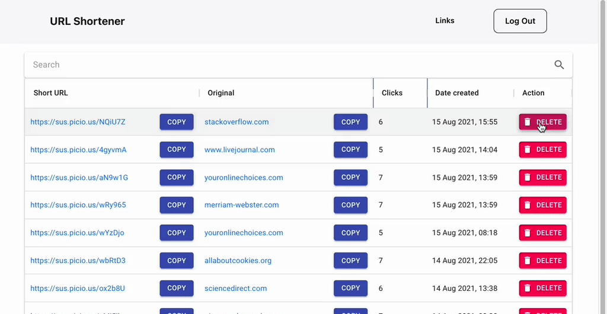

# URL Shortener

Make short, totally not suspicious links. https://sus.picio.us

Create short links:


Sign up to save and manage all your links from a dashboard:


Click analytics tracks how well your links are doing:


Easily remove links you don't want:


## Built with

- [React](https://reactjs.org/) (frontend)
- [Node.js](https://nodejs.org/en/) (backend)
- [Docker](https://www.docker.com/) (backend)
- [Auth0](https://auth0.com/) (authentication)

## Getting started

### Prequisities

- sudo privileges
- npm
- Docker
- auth0 account
- (Deployment only) server (eg. via DigitalOcean) and domain name (eg. via NameCheap)

### Development

- Set up frontend

```
git clone https://github.com/faithcsc/url-shortener
cd url-shortener
npm install
npm start
```

- Set up backend

```
git clone https://github.com/faithcsc/rest-api-tutorial
docker-compose build
docker-compose up
```

### Production

- Point your domain name to your server's IP address: [How can I set up an A (address) record for my domain?](https://www.namecheap.com/support/knowledgebase/article.aspx/319/2237/how-can-i-set-up-an-a-address-record-for-my-domain/)

- Setup Nginx with HTTPS certificates: [How To Secure Nginx with Let's Encrypt on Ubuntu 20.04](https://www.digitalocean.com/community/tutorials/how-to-secure-nginx-with-let-s-encrypt-on-ubuntu-20-04)

- Allow ports 443 and 8443 on your remote server's firewall: [How To Set Up a Firewall with UFW on Ubuntu 18.04](https://www.digitalocean.com/community/tutorials/how-to-set-up-a-firewall-with-ufw-on-ubuntu-18-04)

#### Frontend

- Within `url-shortener`, modify `src/shared/config.js` and replace the following line with your domain:

```
} else {
  config.DB_ENDPOINTS = {
    base: 'https://your_domain.com:8443',
  };
}
```

- (Remote server) [How To Deploy a React Application with Nginx on Ubuntu 20.04](https://www.digitalocean.com/community/tutorials/how-to-deploy-a-react-application-with-nginx-on-ubuntu-20-04)

- Check that your application is up by visiting https://your_domain.com.

#### Backend

- Copy `rest-api-tutorial` to your remote server:

```
scp -r rest-api-tutorial $user:$remote_server:/root/
```

- Build docker containers and enable it on startup:

```
cd /root/rest-api-tutorial
sudo systemctl enable docker
sudo systenctl start docker
docker-compose build
docker-compose up -d
```

## Acknowledgements

- Frontend: [000kelvin/react-landing-page](https://github.com/000kelvin/react-landing-page)

- Backend: [Creating a Secure REST API in Node.js](https://www.toptal.com/nodejs/secure-rest-api-in-nodejs)

- Deployment:

  - [How can I set up an A (address) record for my domain?](https://www.namecheap.com/support/knowledgebase/article.aspx/319/2237/how-can-i-set-up-an-a-address-record-for-my-domain/)

  - [How To Set Up a Firewall with UFW on Ubuntu 18.04](https://www.digitalocean.com/community/tutorials/how-to-set-up-a-firewall-with-ufw-on-ubuntu-18-04)

  - [How To Deploy a React Application with Nginx on Ubuntu 20.04](https://www.digitalocean.com/community/tutorials/how-to-deploy-a-react-application-with-nginx-on-ubuntu-20-04)

  - [Running docker-compose on system startup](https://stackoverflow.com/questions/43671482/how-to-run-docker-compose-up-d-at-system-start-up)

- CI / CD with Travis:

  - [SSH deploys with Travis CI](https://oncletom.io/2016/travis-ssh-deploy/)

- User authentication:

  - [Configure Auth0 for React](https://auth0.com/docs/quickstart/spa/react)

  - [The Complete Guide to React User Authentication with Auth0](https://auth0.com/blog/complete-guide-to-react-user-authentication/)
